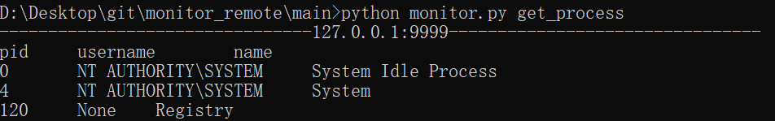
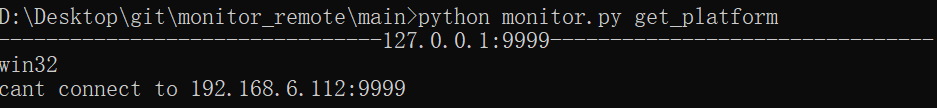
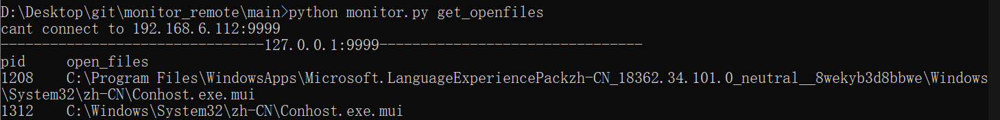
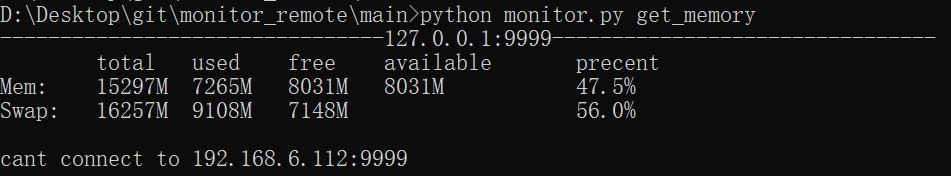
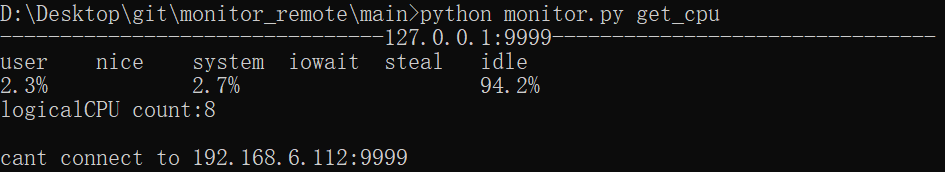

# DTC
Distributed Task Control

# 可以用来做什么

1、本程序基于python的psutil模块开发，可进行**局域网内分布式主机监控**。

2、本程序分为客户端与服务端两部分，可实现跨平台使用。如客户端部署在linux，服务端部署在windows，抑或反之。**当然前提是部署机上拥有python3环境**。

3、方便运维人员了解局域网内主机状态，提升运维人员工作效率。

# 使用方法

## 1、手动获取状态信息

通过此方法可手动获取被监控端主机状态，如**cpu、内存、打开文件、平台、进程**等信息，并默认会以linux上的常用监控工具的监控格式返回。

使用格式：**monitor.py <状态值>**

**在开始获取状态信息之前，需要先执行以下两个步骤：**

a、部署被监控主机。将topath/agent/目录下的文件部署在被监控主机，并配置agent.xml。

​	<local_host>标签内容填上本地即被监控主机的ip:port，该值应对应topath/conf/monitor.xml的<ip_port>。

​	开启mas_agent.py于后台开始监听。

b、在监控主机上配置topath/conf/monitor.xml。

​	<ip_port>标签内容填上需要被监控的主机ip:port。如果需要同时监控多台主机，则增加其父标签<remote_host>的数量并添加对应的<ip_port>。

（1）通过以下命令可获取当前可用的状态值：

```shell
topath/main/monitor.py get_situation
```


（2）获取进程信息：

```shell
topath/main/monitor.py get_process
```



（3）获取平台信息：

```shell
topath/main/monitor.py get_platform
```



（4）获取打开文件信息：

```shell
topath/main/monitor.py get_openfiles
```



（5）获取内存信息：

```shell
topath/main/monitor.py get_memory
```



（6）获取cpu信息：

```shell
topath/main/monitor.py get_cpu
```



## 2、自动监控进程状态

通过此方法可自动监控被监控主机上的process是否仍存在。实现当进程死掉后及时被运维人员知晓的作用。**监控日志会保存于topath/logs/ip/ip_port_process_date.log。**

**在开始自动监控进程状态之前，需要先执行以下两个步骤：**

a、部署被监控主机。将topath/agent/目录下的文件部署在被监控主机，并配置agent.xml。

​	<local_host>标签内容填上本地即被监控主机的ip:port，该值应对应topath/conf/monitor.xml的<ip_port>。

​	开启mas_agent.py于后台开始监听。

b、在监控主机上配置topath/conf/monitor.xml。

​	<ip_port>标签内容填上需要被监控的主机ip:port。

​	<monitor_pid>标签内容上填写在被监控主机上需要被监控的进程对应的pid，如果为多个则用 “,” 分隔。

​	<detect_interval_time>标签内容上填写监控间隔时间，默认不填写为3600秒监控一次。

​	如果需要同时监控多台主机，则增加其父标签<remote_host>的数量并添加对应的<ip_port>。

​	配置完毕后开启topath/main/auto_monitor_process.py于后台开始监控（被监控主机必须已开启mas_agent.py并处于监听状态）。

## 3、自动监控日志文件

通过此方法可自动实时监控被监控主机上的日志情况，类似于linux上的tailf命令，实现运维人员在监控主机端便可实时了解被监控主机上的log日志情况。**监控日志会保存于topath/logs/ip/alias.log。**

**在开始自动监控进程状态之前，需要先执行以下两个步骤：**

a、在监控主机上配置topath/conf/monitor.xml。

​	<local_host>标签内容填上本地即监控主机的ip:port。

​	开启topath/main/auto_monitor_log.py于后台开始监听。

b、部署被监控主机。将topath/agent/目录下的文件部署在被监控主机，并配置agent.xml。

​	<monitor_host>标签内容填上监控主机端的ip:port，该值应对应topath/conf/monitor.xml的<local_host>。

​	<scan_file_time>标签内容填上扫描文件的间隔时间，默认不填写为3秒。

​	在<monitor_files>中添加<file_alias>标签，并填写需要被监控的文件，格式为<file_alias>topath,alias.log</file_alias>其中topath为被监控文件的路径，alias.log为对被监控文件命名的别名，该日志会在监控主机端的以别名的命名方式存留。

​	配置完毕后开启mas_agent_log.py于后台开始监控日志。

